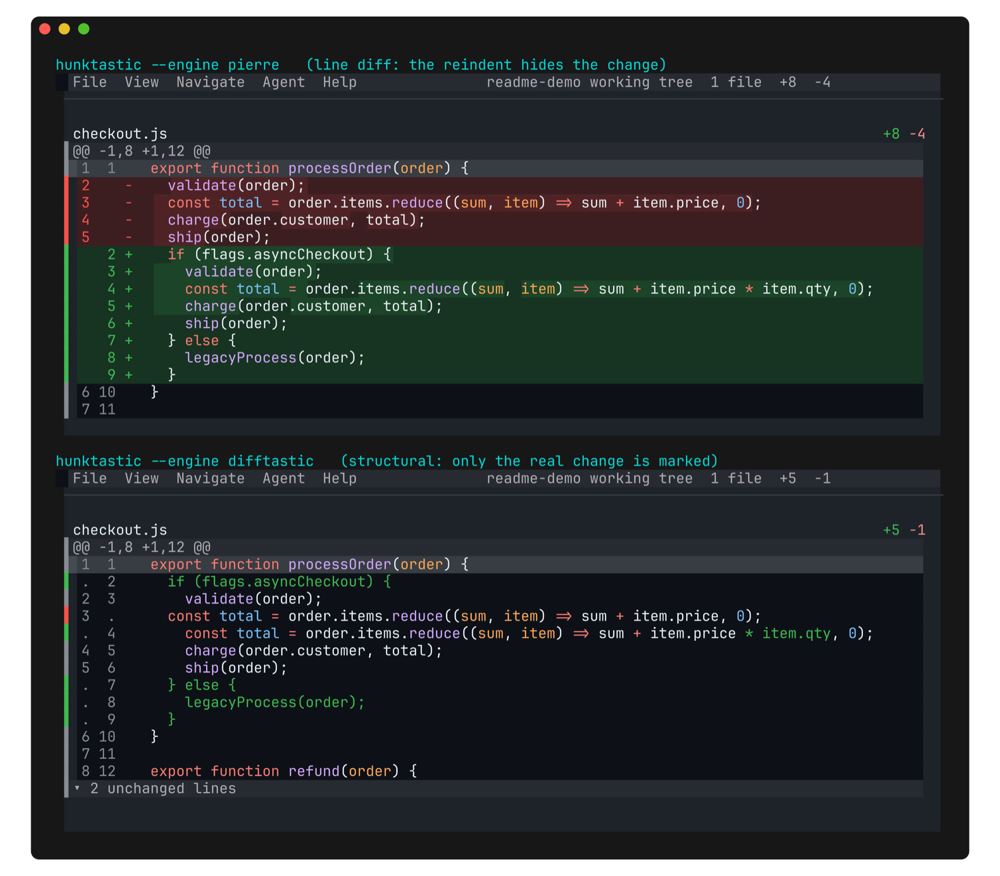
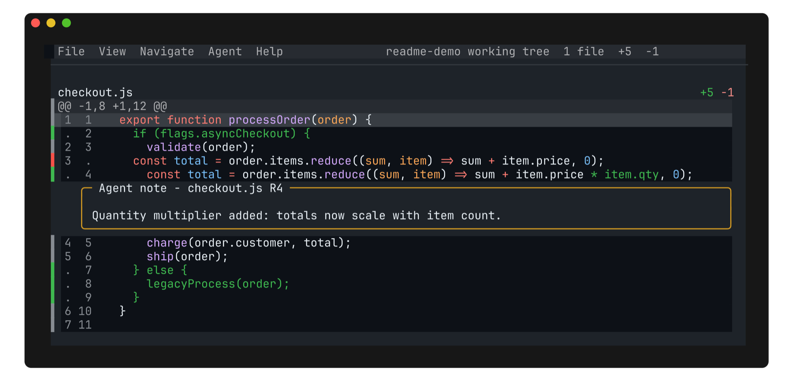

# hunktastic

Semantic diffs that agents can notate.

hunktastic is a fork of [hunk](https://github.com/modem-dev/hunk) that adds
[difftastic](https://github.com/Wilfred/difftastic) as a diff engine. Hunk's review
stream, agent annotations and keybindings are unchanged; the diff underneath them
becomes structural.

[](LICENSE)

A line diff sees a reindent as a rewrite. A structural diff sees the syntax tree, so
only the real change is marked.



Agent notes anchor to structural hunks, so an agent can explain the change that
actually happened.



## Install

```bash
brew install zamua/tap/hunktastic
```

Nix, using the flake:

```nix
inputs.hunktastic.url = "git+https://github.com/Zamua/hunktastic?shallow=1";
```

The flake exports a `default` package and a home-manager module (`programs.hunk`, with
`installDifftastic` on by default).

Both installs bring in difftastic. Installing another way means installing
[difftastic](https://github.com/Wilfred/difftastic) too, since the engine runs `difft`
as a subprocess. Without it, hunktastic still runs and falls back to line diffs with a
notice.

macOS arm64 for the Homebrew build. Other platforms build from source.

## Use it

```bash
hunk diff --engine difftastic
```

To make it the default, set the engine in `~/.config/hunk/config.toml`:

```toml
engine = "difftastic"
```

`--engine pierre` switches back to hunk's line engine for a single run.

Structural diffs need both file bodies, so the engine applies to hunk's own loaders
(`hunk diff`, `hunk show`). Git pager mode only ever receives a finished unified patch,
so it stays on the line engine. Wire up git aliases that call hunktastic directly:

```bash
git config --global alias.hdiff '!f() { cd "${GIT_PREFIX:-.}" && hunk diff "$@"; }; f'
git config --global alias.hshow '!f() { cd "${GIT_PREFIX:-.}" && hunk show "$@"; }; f'
```

Files fall back to the line engine individually when difft cannot map them, and the
review reports which engine produced each file:

```bash
hunk session review <session-id> --json   # -> engine: difftastic | pierre, per file
```

Hunk numbers are engine-relative, so agents should prefer `--old-line` / `--new-line`
anchors, which resolve under either engine. `hunk skill path` prints the bundled agent
skill, which documents this.

## Everything else

Identical to hunk. Keybindings, layouts, themes, sidebar, watch mode, extensions,
jujutsu and sapling support, the `hunk session` agent API, and the config file are all
upstream's, unchanged. See [hunk's README](https://github.com/modem-dev/hunk#readme) and
[hunk.dev/docs](https://hunk.dev/docs/) for all of it.

Design notes for the engine live in [docs/difftastic-engine.md](docs/difftastic-engine.md).

## Credits

hunk by Ben Vinegar and the Modem team. difftastic by Wilfred Hughes. See
[ACKNOWLEDGEMENTS.md](ACKNOWLEDGEMENTS.md).

## License

[MIT](LICENSE)
